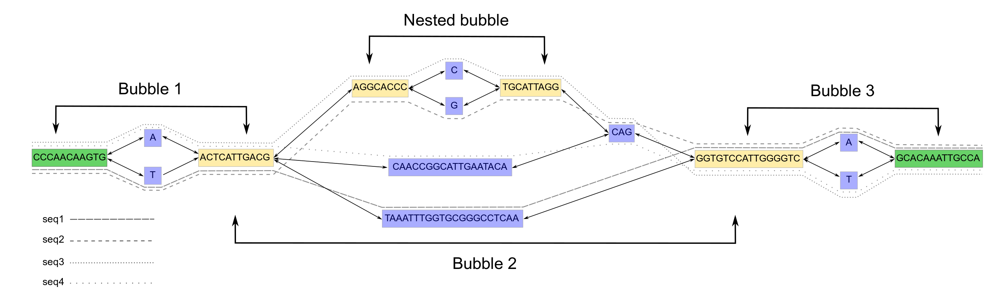

.. include:: ../substitutions.rst

Graph Structures: BubbleGun
^^^^^^^^^^^^^^^^^^^^^^^^^^^^^

`BubbleGun <https://github.com/fawaz-dabbaghieh/bubble_gun>`_ is a tool that identifies topological structures in a graph (GFA file).
These topological structures can be nested within each other, forming a hierarchical chain of superstructures.
The BubbleGun source code has been integrated into the |tool| back-end code.

Structure Definitions
~~~~~~~~~~~~~~~~~~~~~~~~

``Segment`` - a contiguous chunk of sequence with no variation. Basic nodes that make up a graph genome.

``SuperBubble`` - an acyclic, directed subgraph where nodes *s* and *t* are the source and sink nodes, respectively.
All paths that start at *s* end up at *t*.

``Bubble`` - a specific type of ``SuperBubble`` where there are only two disjoint paths between *s* and *t*. 
Ex. a simple bialleleic SNP or indel.

``BubbleChain`` - a subgraph containing one or more ``Bubble`` such that the sink node of one is the source node of the next.

The figure below is from the `BubbleGun publication <https://doi.org/10.1093/bioinformatics/btac448>`_.

   A short ``BubbleChain`` composed of two simple SNP ``Bubble`` structures and one ``SuperBubble`` with another ``Bubble`` nested inside.

.. note:: 
    These definitions are used by BubbleGun. In |tool|, we refer to both types of bubbles simply as a |bubble|.
    We define subtypes |simple| and |super| to differentiate between a ``Bubble`` and a ``SuperBubble``, respectively.
    We also refer to a ``BubbleChain`` as simply |chain|.