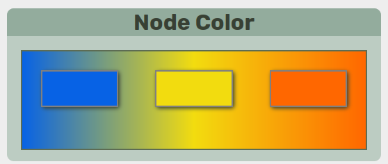
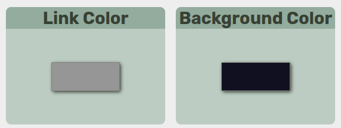

.. _colors:
.. include:: ../substitutions.rst

Colors
-----------------------

Color Selection
~~~~~~~~~~~~~~~~~

|tool| provides different methods of coloring the nodes in the visualization.
Node colors are selected on a 3-color gradient.

   **Node Color** section of |tool|. 

.. figure:: ../_images/preset_colors.png
   :alt: preset colors
   :align: center

   **Preset Color** section of |tool|.

|tool| has a set of built-in color palettes that can be selected from. 
Color palette can be manually changed by clicking on each color box.

.. note:: 
    Some palettes are better for discrete colors and some are better for heatmap gradients.

.. note:: 
    An attempt was made to provide multiple colorblind-friendly palettes but not all of them are guaranteed to be safe.

   **Link Color** and **Background Color** section of |tool|.

Additionally, link and background colors can be manually changed.

Color Style
~~~~~~~~~~~~~~~~~

Depending on the mode selected, the colors will either be used to form as a continuous gradient/heatmap or will be used as three discrete colors. 

.. raw:: html

   
<i class="fa-solid fa-circle-nodes xl"></i> <b>Node Type</b> <code>discrete</code>

The color is determined by the type of node, |segment|, |bubble| or |chain|

.. raw:: html

   
<i class="fa-solid fa-arrows-to-circle xl"></i> <b>Bubble Size</b> <code>continuous</code>

The color is determined by the total number of |segment| inside a |bubble| or |chain|. 
Not to be confused with "length" which is based on the total number of basepairs.

.. raw:: html

   
<i class="fa-solid fa-arrow-down-short-wide xl"></i> <b>Node Length</b> <code>continuous</code>

The color is determined by the total number of basepairs represented by a node. 

.. raw:: html

   
<i class="fa-solid fa-shuffle xl"></i> <b>Ref/Alt</b> <code>discrete</code>

Reference path and alternative paths are colored differently. This is a 2-color scheme that uses the two ends of the color gradient. 

.. raw:: html

   
<i class="fa-solid fa-dna xl"></i> <b>GC Content</b> <code>continuous</code>

The color is determined by the total GC percentage of all basepairs represented by a node (with the full human genome averaging 41%).

