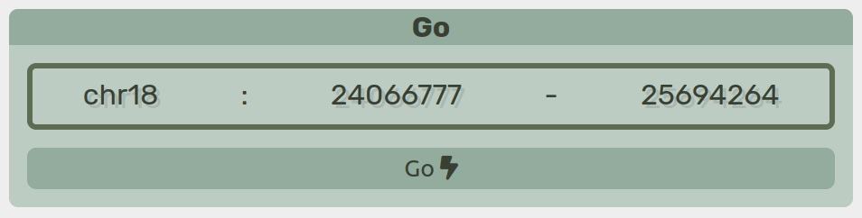
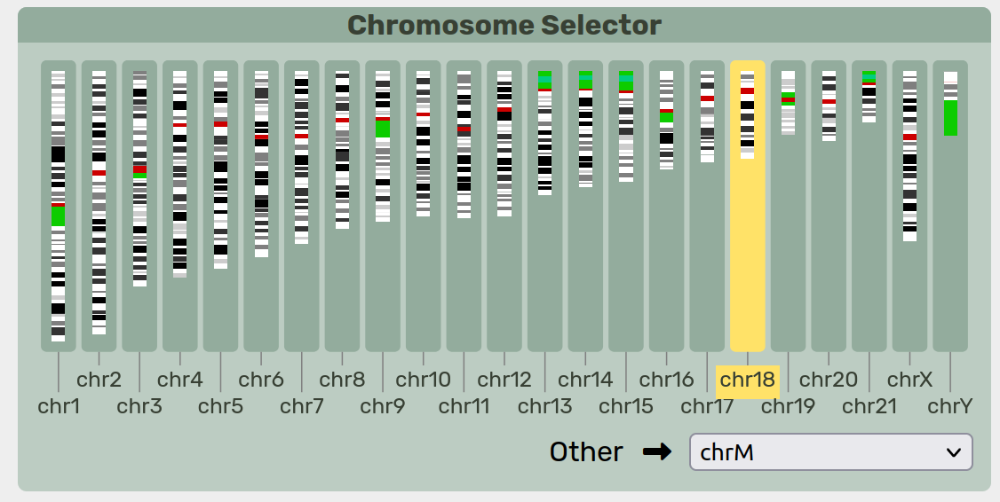
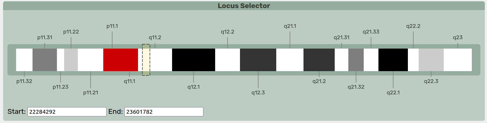
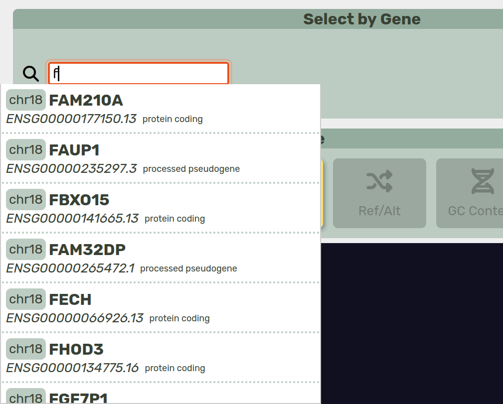

.. _regions:
.. include:: ../substitutions.rst

Choosing a Region
==================================

Selecting by Coordinate
--------------------------

|tool| uses a coordinate system based on one of the reference paths embedded in the sequence graph. The primary coordinate system is specified during setup — typically using a reference genome such as GRCh38 or CHM13.

   Coordinate section.

.. raw:: html

   

      <code><i class="fas fa-crosshairs"></i></code> Manually enter or adjust the coordinate range.
       
      <code><i class="fas fa-copy"></i></code> Copy the current coordinate range.
       
      <code><i class="fas fa-plus-minus"></i></code> Set the number of flanking base pairs to include.
       
      <code><i class="fas fa-minus"></i></code> Include flanking sequence upstream of the coordinate range.
       
      <code><i class="fas fa-plus"></i></code> Include flanking sequence downstream of the coordinate range.
       
      <code>Go <i class="fas fa-bolt-lightning"></i></code> Retrieve and display the specified coordinate range.
   

   Each method below also fills the <i class="fas fa-crosshairs"></i> with a set of coordinates.

Selecting by Chromosome
--------------------------

Range selection can be done by choosing a chromosome and highlighting a region.

   Chromosome Selector.

By default, |tool| assumes a standard set of human chromosomes. Future versions of the software may accomodate different chromsomes for non-human species. Non-canonical chromosomes can be found in the ``Other`` selection box.
Only one chromosome can be selected at a time.

   Locus Selector.

A cytoband display of the highlighted chromosome is rendered. Clicking and dragging along the chromosome will select a specific region. At this time, large regions may not be viewable due to the amount of data, but this limitation is a high priority for future improvments. 

Selecting by Gene
--------------------------

Gene annotations in GFF3 format, such as those provided by `GENCODE <https://www.gencodegenes.org/human/>`_, may be preloaded into |tool| and indexed for search.
The gene search bar shows these genes and allow for rapid selection of a particular region.

   Select by Gene.

