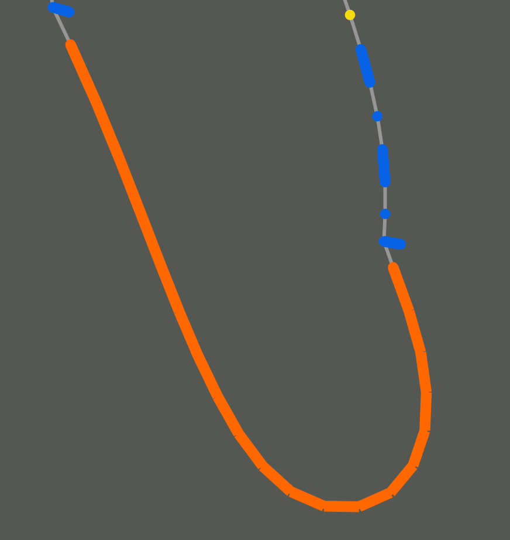
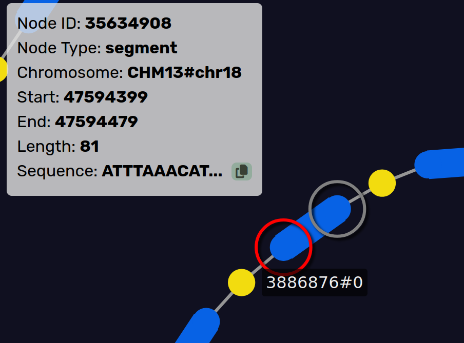

.. _visuals:
.. include:: ../substitutions.rst

Viewing the Pangenome
==================================

Rendering
-----------------------

.. figure:: ../_images/segment_node.png
   :alt: segment
   :align: center
   :height: 200px

   A |segment|.

A |segment| from the GFA file (``S`` line). 
A single chunk of sequence, has reference coordinates if on the reference path.
Links show possible paths through the pangenome (the ``L`` lines from the GFA file).

.. figure:: ../_images/bubble_node.png
   :alt: bubble
   :align: center
   :height: 200px

   Left shows a |bubble|, right shows the contents inside.

Hides an acyclic subgraph of branching paths that start at one |segment| and all end at another.
Can be |simple| if there are only two disjoint paths between the source and sink nodes, otherwise it is classified as |super|.

   Left shows the |chain|, right shows the contents inside.

A |chain| is a series of connected |bubble|.

Actions
-----------------------

   Hovering over a node highlights it and shows information.

   Clicking and dragging a node moves it around.

.. figure:: ../_images/bubble_node.png
   :alt: popping a bubble
   :align: center
   :height: 200px

   Clicking on a |bubble| or |chain| node pops it open.

Annotations
-----------------------

The gene annotations are sourced from `GENCODE <https://www.gencodegenes.org/human/>`_ but if using a custom pangnome, any GFF3 file can be used to annotate genes.

.. figure:: ../_images/gene_annotation.png
   :alt: gene annotation
   :align: center

   A gene annotation.

