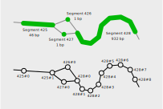

.. include:: ../substitutions.rst

Rendering: D3 Force Graph
^^^^^^^^^^^^^^^^^^^^^^^^^^^^^^

|tool| uses the `D3 Force Graph library <https://github.com/vasturiano/force-graph>`_ to draw the graph representation.

This library is able to render the graph given a set of nodes and links.
In |tool|, segments of sequence are represented by nodes. 
These segments can have variable length and it was important to capture the length information in the rendering of the graph.
|tool| splits up longer segments into a series of connected D3 nodes, using thickly drawn links to give the illusion of length. 

   How the stylized |segment| appear (top) versus how they structured from the perspective of the D3 engine (bottom).

For example, ``Segment 426`` and ``Segment 427`` represent a SNP, and are drawn with a single D3 node.
In contrast, ``Segment 428`` is 932 base pairs long and is drawn with 9 nodes, internally named ``428#0`` through ``428#8``.

#todo forces
#todo annotations

