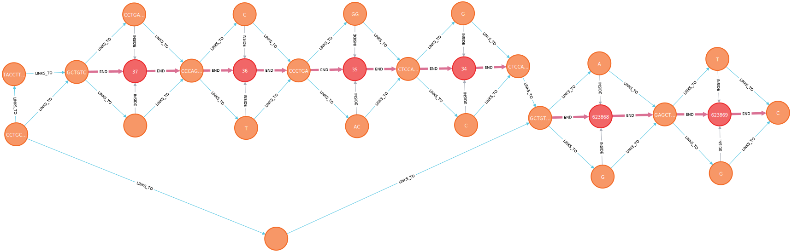
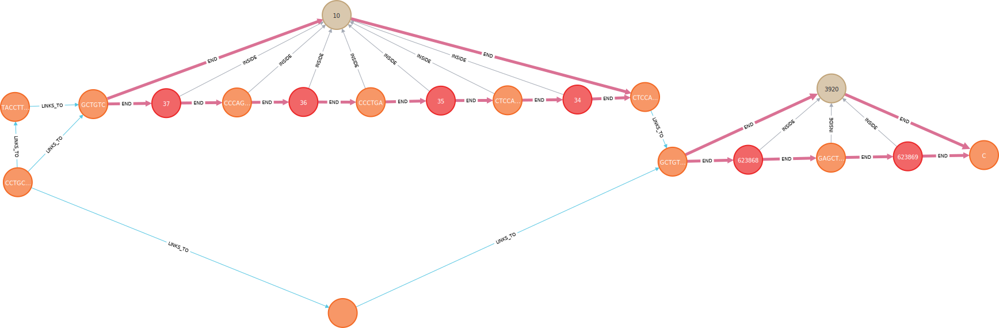

.. include:: ../substitutions.rst

Database: Neo4j
^^^^^^^^^^^^^^^^^^^^^^^^

`Neo4j <https://neo4j.com/>`_ is a graph database where data is stored as a series of nodes and relationships.
Neo4j mirrors the stucture of the graph genomes which makes it ideal for storage and queries. 
During setup of |tool|, a GFA file is parsed and the ``S``, ``L``, ``P``, ``W`` lines are extracted.
|bubble| and |chain| superstructures are enumerated by BubbleGun.
Layout positions are calculated by odgi. These are all fed into the Neo4j database.

Schema
~~~~~~~~~~~~~~~~~~~~~

|segment| - The ``S`` lines from the GFA file. They have these properties:

+--------------+---------+-----------------------------------------------------------------------------------+
| Property     | Type    | Description                                                                       |
+==============+=========+===================================================================================+
| **<id>**     | integer | Internal Neo4j ID.                                                                |
+--------------+---------+-----------------------------------------------------------------------------------+
| **db**       | string  | Database ID name.                                                                 |
+--------------+---------+-----------------------------------------------------------------------------------+
| **id**       | integer | ID from GFA file.                                                                 |
+--------------+---------+-----------------------------------------------------------------------------------+
| **isRef**    | integer | Segment is part of reference sequence.                                            |
+--------------+---------+-----------------------------------------------------------------------------------+
| **genome**   | string  | Genome name.                                                                      |
+--------------+---------+-----------------------------------------------------------------------------------+
| **chrom**    | string  | Structured as ``genome_id#chromosome_id``. Optional.                              |
+--------------+---------+-----------------------------------------------------------------------------------+
| **start**    | integer | Start position with respect to reference genome. Optional.                        |
+--------------+---------+-----------------------------------------------------------------------------------+
| **end**      | integer | End position with respect to reference genome. Optional.                          |
+--------------+---------+-----------------------------------------------------------------------------------+
| **sequence** | string  | DNA sequence, blank if node represents a deletion.                                |
+--------------+---------+-----------------------------------------------------------------------------------+
| **length**   | integer | DNA sequence length.                                                              |
+--------------+---------+-----------------------------------------------------------------------------------+
| **gcCount**  | integer | Number of G or C bases in DNA sequence.                                           |
+--------------+---------+-----------------------------------------------------------------------------------+
| **x1**       | float   | Layout x-coordinate for start position.                                           |
+--------------+---------+-----------------------------------------------------------------------------------+
| **y1**       | float   | Layout y-coordinate for start position.                                           |
+--------------+---------+-----------------------------------------------------------------------------------+
| **x2**       | float   | Layout x-coordinate for end position.                                             |
+--------------+---------+-----------------------------------------------------------------------------------+
| **y2**       | float   | Layout y-coordinate for end position.                                             |
+--------------+---------+-----------------------------------------------------------------------------------+

|bubble| and |chain| - Identified by BubbleGun. They have these properties:

+-------------------+---------+-----------------------------------------------------------------------------------+
| Property          | Type    | Description                                                                       |
+===================+=========+===================================================================================+
| **<id>**          | integer | Internal Neo4j ID.                                                                |
+-------------------+---------+-----------------------------------------------------------------------------------+
| **db**            | string  | Database ID name.                                                                 |
+-------------------+---------+-----------------------------------------------------------------------------------+
| **id**            | integer | ID from BubbleGun.                                                                |
+-------------------+---------+-----------------------------------------------------------------------------------+
| **subtype**       | string  | To define different subtypes, ex. |simple|, |super|, etc. Optional.               |
+-------------------+---------+-----------------------------------------------------------------------------------+
| **n**             | integer | Number of nodes inside the structure.                                             |
+-------------------+---------+-----------------------------------------------------------------------------------+
| **size**          | integer | Total sum of the sequence length of every node inside the structure.              |
+-------------------+---------+-----------------------------------------------------------------------------------+
| **largest_child** | integer | The largest **n** of the nodes inside the structure.                              |
+-------------------+---------+-----------------------------------------------------------------------------------+
| **genome**        | string  | Genome name.                                                                      |
+-------------------+---------+-----------------------------------------------------------------------------------+
| **chrom**         | string  | Structured as ``genome_id#chromosome_id``. Optional.                              |
+-------------------+---------+-----------------------------------------------------------------------------------+
| **start**         | integer | Min start position of every node inside the structure. Optional.                  |
+-------------------+---------+-----------------------------------------------------------------------------------+
| **end**           | integer | Max end position of every node inside the structure. Optional.                    |
+-------------------+---------+-----------------------------------------------------------------------------------+
| **gcCount**       | integer | Number of G or C bases in DNA sequence.                                           |
+-------------------+---------+-----------------------------------------------------------------------------------+
| **x**             | float   | Layout x-coordinate, based on center of mass (ie. sequence length).               |
+-------------------+---------+-----------------------------------------------------------------------------------+
| **y**             | float   | Layout y-coordinate, based on center of mass (ie. sequence length).               |
+-------------------+---------+-----------------------------------------------------------------------------------+
| **x1**            | float   | Min x-coordinate of every node inside the structure.                              |
+-------------------+---------+-----------------------------------------------------------------------------------+
| **y1**            | float   | Min y-coordinate of every node inside the structure.                              |
+-------------------+---------+-----------------------------------------------------------------------------------+
| **x2**            | float   | Max x-coordinate of every node inside the structure.                              |
+-------------------+---------+-----------------------------------------------------------------------------------+
| **y2**            | float   | Max y-coordinate of every node inside the structure.                              |
+-------------------+---------+-----------------------------------------------------------------------------------+

``Gene``, ``Transcript`` and ``Exon`` follow the structure of GFF3 files.

Relationships
~~~~~~~~~~~~~~~~~~~~~

|linksto| : The ``L`` lines from the GFA.

 |segment| — |linksto| → |segment|

|end| : The source or sink node of a |bubble| or |chain|.

 |segment| — |end| → |bubble|

 |segment| ← |end| — |bubble|

 |segment| — |end| → |chain|

 |segment| ← |end| — |chain|

|inside| : Nodes that are part of a larger superstructure.

 |segment| — |inside| → |bubble|

 |bubble| — |inside| → |chain|

 |segment| — |inside| → |chain|

 |chain| — |inside| → |bubble|

Additionally, gene annotations also use the |inside| relationship

 ``Exon`` — |inside| → ``Transcript``

 ``Transcript`` — |inside| → ``Gene``

Example
~~~~~~~~~~~~~~~~~~~~~

   Showing |segment| nodes as orange and |bubble| nodes as red. 
   A series of substitution variants alongside a larger deletion variant.
   The node at the bottom is represents a deletion allele.

   Hiding any |segment| nodes that were inside a |bubble|. 
   Showing |chain| nodes as light brown.
   Two |chain| are formed, separated by the large deletion allele.

