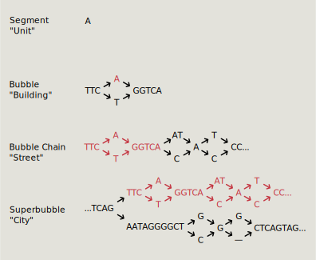

.. include:: substitutions.rst
.. figure:: _images/pangyplot_header.svg
   :target: index.html
   :width: 500px
   :alt: PangyPlot

|tool|
==================================

|tool| is a visualization tool developed for human pangenomic data. A public version preloaded with data is available here:

https://pangyplot.research.sickkids.ca/ 

 Data used here is from the `Human Pangenome Reference Consortium <https://github.com/human-pangenomics/hpp_pangenome_resources>`_ (minigraph-cactus).

.. figure:: _images/ui_screenshot.png
   :alt: user interface
   :align: center

   Screenshot of |tool|.

Motivation
---------------

A visual interface is fundamental for detecting patterns and gaining meaningful insights into large, complex genomic datasets.
Pangenomes typically rely on a graph-based data structure, which is very difficult to navigate without a visualization of the graph topology.

Graph genomes are particularly challenging to analyze because they include billions of base pairs and encompass all the potential variations within them.
The range of variation size is also large. For instance, examining the relationship between a SNP and a 20kb structural variant represents a 20,000-fold difference in scale.

To overcome these issues, consider the system used for structuring physical locations:

.. figure:: _images/graph_analogy.svg
   :alt: Units ➜ Buildings ➜ Streets ➜ Cities ➜ ...
   :width: 500px
   :align: center

   Physical locations have a hierarchical relationship. The level of detail needed depends on the goal.
 

Online map applications need to meet a diverse set of demands: from navigating between countries, finding an intersection, directions to the front door of a building. 
These applications hide unnecessary details based on the user's zoom level, focusing on major highways or rail lines when zoomed out and only showing the name of tiny side streets when zoomed all the way in.

   Genetic variation has a hierarchical relationship. The level of detail needed also depends on the goal.
 
Likewise, analysis of genetic variation can happen at very different scales from the chromosomal level, to structural variation to indivdual SNPs.
|tool| aims to capture common topological patterns in graph genomes and builds a hierarchical structure of the variation in the genome.
This allows users to control the level of detail visible and also limits the computation necessary to view large regions by abstracting the details.

|git|

.. toctree::
   :maxdepth: 2
   :caption: Table of Contents
    
   setup
   usage
   implementation
