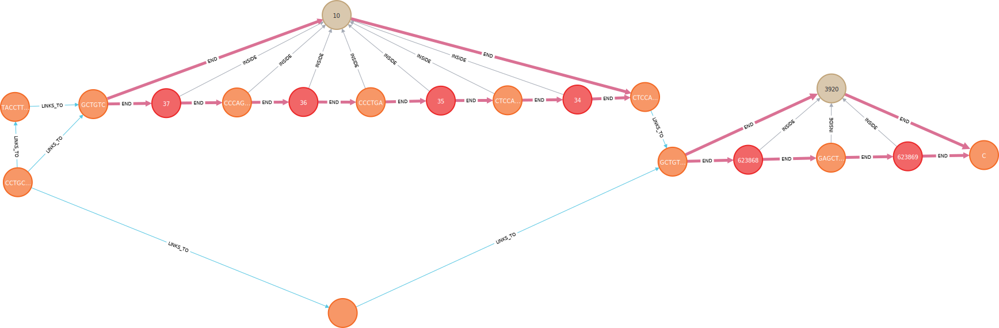

.. include:: ../substitutions.rst

Installing Neo4j
------------------------------

The `(official Neo4j installation guide) <https://neo4j.com/docs/operations-manual/current/installation/>`_ should be consulted for up-to-date information. Below are quick guides for Ubuntu and CentOS.

**Ubuntu / Debian (APT)**

1. Add the Neo4j GPG key and repository:
   
   .. code-block:: bash

      wget -O - https://debian.neo4j.com/neotechnology.gpg.key | sudo gpg --dearmor -o /etc/apt/keyrings/neotechnology.gpg
      echo 'deb [signed-by=/etc/apt/keyrings/neotechnology.gpg] https://debian.neo4j.com stable latest' | sudo tee -a /etc/apt/sources.list.d/neo4j.list
      sudo apt-get update

2. Install a specific version of Neo4j (recommended: 5.24.0):

   .. code-block:: bash

      sudo apt-get install neo4j=1:5.24.0

3. Enable and start the Neo4j service:

   .. code-block:: bash

      sudo systemctl enable neo4j
      sudo systemctl start neo4j

**CentOS / RHEL (RPM)**

1. Install Java 17 (required for Neo4j 5.x):

   .. code-block:: bash

      wget https://download.oracle.com/java/17/latest/jdk-17_linux-x64_bin.rpm
      sudo rpm --install jdk-17_linux-x64_bin.rpm
      java -version

2. Download and install Neo4j and Cypher Shell:

   .. code-block:: bash

      curl -O https://dist.neo4j.org/cypher-shell/cypher-shell-5.23.0-1.noarch.rpm
      curl -O https://dist.neo4j.org/rpm/neo4j-5.23.0-1.noarch.rpm
      sudo rpm --install cypher-shell-5.23.0-1.noarch.rpm neo4j-5.23.0-1.noarch.rpm

3. Enable Neo4j on boot:

   .. code-block:: bash

      sudo systemctl enable neo4j

> For more details, refer to the `Neo4j RPM installation guide <https://neo4j.com/docs/operations-manual/current/installation/linux/rpm/>`_

Accessing the Neo4j Database
~~~~~~~~~~~~~~~~~~~~~~~~~~~~~~

Once Neo4j is running, you can access the browser-based interface to manage the database.

**Local Access**

If you're running Neo4j on your local machine:

1. Open your browser and go to: http://localhost:7474

2. Log in with:

   - **Username:** `neo4j`
   - **Password:** `neo4j`

   You'll be prompted to change the password on your first login.

The Neo4j browser also has a built-in visual explorer:

**Remote Access via SSH Tunnel**

If Neo4j is running on a remote server, you can create a secure SSH tunnel to access it locally:

.. code-block:: bash

   ssh -L 7475:localhost:7474 user@remote-server

Then open your browser and go to: http://localhost:7475

This will forward the Neo4j web interface from the remote server to your local machine, allowing full access through the browser.
