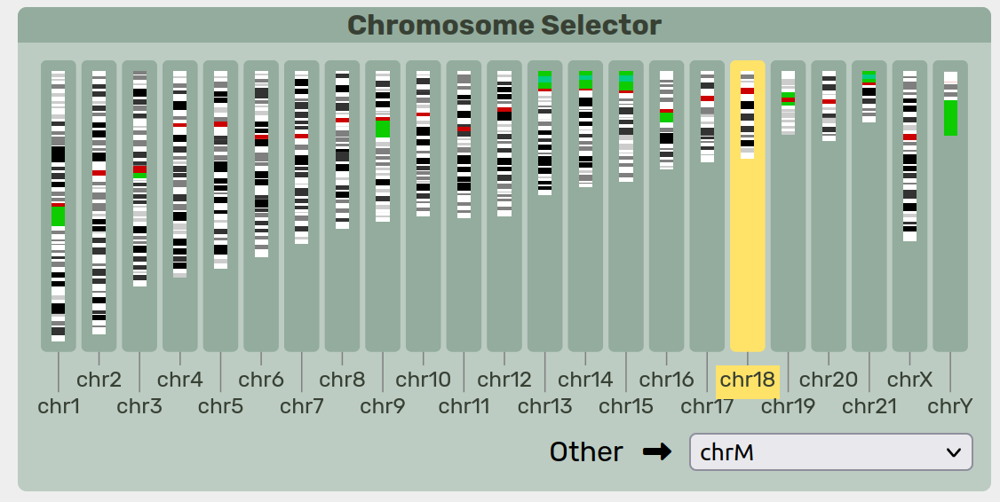
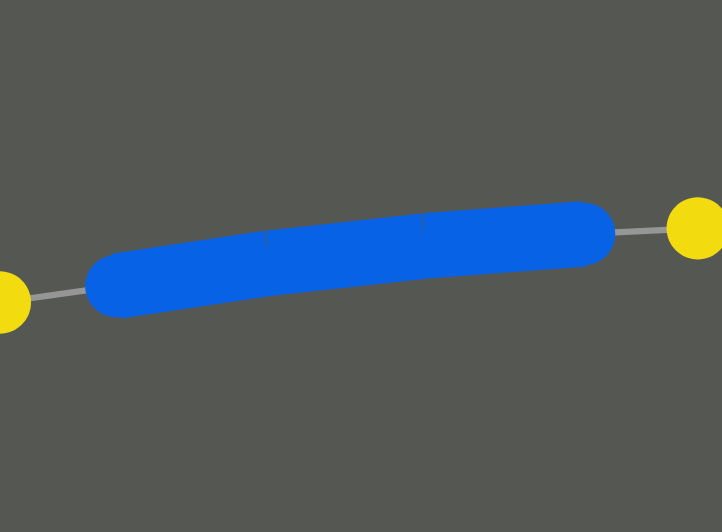
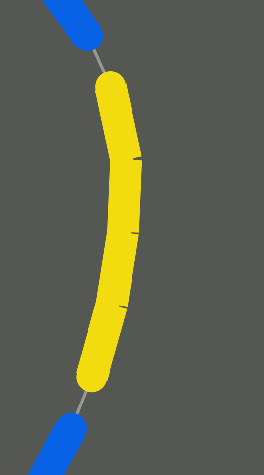
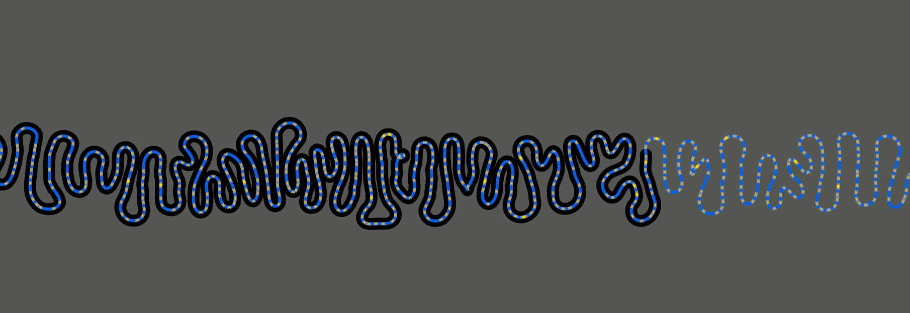
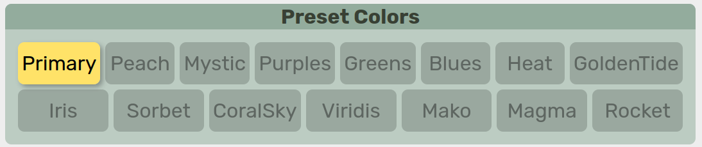

.. _usage:
.. include:: substitutions.rst

Usage
==================================

Choosing a Region
-----------------------

|tool| uses a coordinate system based on one of the reference paths embedded in the sequence graph. The primary coordinate system is specified during setup — typically using a reference genome such as GRCh38 or CHM13.

.. figure:: _images/go_button.png
   :alt: coordinate section
   :align: center

   Coordinate section of |tool|.

.. raw:: html

   

      <code><i class="fas fa-crosshairs"></i></code> Manually enter or adjust the coordinate range.
       
      <code><i class="fas fa-copy"></i></code> Copy the current coordinate range.
       
      <code><i class="fas fa-plus-minus"></i></code> Set the number of flanking base pairs to include.
       
      <code><i class="fas fa-minus"></i></code> Include flanking sequence upstream of the coordinate range.
       
      <code><i class="fas fa-plus"></i></code> Include flanking sequence downstream of the coordinate range.
       
      <code>Go <i class="fas fa-bolt-lightning"></i></code> Retrieve and display the specified coordinate range.
   

   Each method below also fills the <i class="fas fa-crosshairs"></i> with a set of coordinates.

Selecting by Chromosome
~~~~~~~~~~~~~~~~~~~~~~~~

Range selection can be done by choosing a chromosome and highlighting a region.

   **Chromosome Selector** section of |tool|.

By default, |tool| assumes a standard set of human chromosomes. Future versions of the software may accomodate different chromsomes for non-human species. Non-canonical chromosomes can be found in the ``Other`` selection box.
Only one chromosome can be selected at a time.

.. figure:: _images/locus_selector.png
   :alt: locus selector
   :align: center

   **Locus Selector** section of |tool|.

A cytoband display of the highlighted chromosome is rendered. Clicking and dragging along the chromosome will select a specific region. At this time, large regions may not be viewable due to the amount of data, but this limitation is a high priority for future improvments. 

Selecting by Gene
~~~~~~~~~~~~~~~~~~~~~~~~

Gene annotations in GFF3 format, such as those provided by `GENCODE 🔗 <https://www.gencodegenes.org/human/>`_, may be preloaded into |tool| and indexed for search.
The gene search bar shows these genes and allow for rapid selection of a particular region.

.. figure:: _images/gene_selector.png
   :alt: gene selector
   :align: center

   **Select by Gene** section of |tool|.

Viewing the Pangenome
-----------------------

Rendering
~~~~~~~~~~~~~~~~~

   A |segment|.

A |segment| from the rGFA file (``S`` line). 
A single chunk of sequence, has reference coordinates if on the reference path.
Links show possible paths through the pangenome (the ``L`` lines from the rGFA file).

   Left shows a |bubble|, right shows the contents inside.

Hides an acyclic subgraph of branching paths that start at one |segment| and all end at another.
Can be |simple| if there are only two disjoint paths between the source and sink nodes, otherwise it is classified as |super|.

.. figure:: _images/chain_node.png
   :alt: bubble chain
   :align: center
   :height: 200px

   Left shows the |chain|, right shows the contents inside.

A |chain| is a series of connected |bubble|.

Actions
~~~~~~~~~~~~~~~~~

.. figure:: _images/highlight_node.png
   :alt: highlighting a node
   :align: center

   Hovering over a node highlights it and shows information.

.. figure:: _images/highlight_node.png
   :alt: dragging a node
   :align: center

   Clicking and dragging a node moves it around.

   Clicking on a |bubble| or |chain| node pops it open.

Annotations
~~~~~~~~~~~~~~~~~

The gene annotations are sourced from `GENCODE 🔗 <https://www.gencodegenes.org/human/>`_ but if using a custom pangnome, any GFF3 file can be used to annotate genes.

   A gene annotation.

Colors
-----------------------

Color Selection
~~~~~~~~~~~~~~~~~

|tool| provides different methods of coloring the nodes in the visualization.
Node colors are selected on a 3-color gradient.

.. figure:: _images/color_gradient.png
   :alt: color gradient
   :align: center

   **Node Color** section of |tool|. 

   **Preset Color** section of |tool|.

|tool| has a set of built-in color palettes that can be selected from. 
Color palette can be manually changed by clicking on each color box.

.. note:: 
    Some palettes are better for discrete colors and some are better for heatmap gradients.

.. note:: 
    An attempt was made to provide multiple colorblind-friendly palettes but not all of them are guaranteed to be safe.

.. figure:: _images/other_colors.png
   :alt: link and background colors
   :align: center

   **Link Color** and **Background Color** section of |tool|.

Additionally, link and background colors can be manually changed.

Color Style
~~~~~~~~~~~~~~~~~

Depending on the mode selected, the colors will either be used to form as a continuous gradient/heatmap or will be used as three discrete colors. 

.. raw:: html

   
<i class="fa-solid fa-circle-nodes xl"></i> <b>Node Type</b> <code>discrete</code>

The color is determined by the type of node, |segment|, |bubble| or |chain|

.. raw:: html

   
<i class="fa-solid fa-arrows-to-circle xl"></i> <b>Bubble Size</b> <code>continuous</code>

The color is determined by the total number of |segment| inside a |bubble| or |chain|. 
Not to be confused with "length" which is based on the total number of basepairs.

.. raw:: html

   
<i class="fa-solid fa-arrow-down-short-wide xl"></i> <b>Node Length</b> <code>continuous</code>

The color is determined by the total number of basepairs represented by a node. 

.. raw:: html

   
<i class="fa-solid fa-shuffle xl"></i> <b>Ref/Alt</b> <code>discrete</code>

Reference path and alternative paths are colored differently. This is a 2-color scheme that uses the two ends of the color gradient. 

.. raw:: html

   
<i class="fa-solid fa-dna xl"></i> <b>GC Content</b> <code>continuous</code>

The color is determined by the total GC percentage of all basepairs represented by a node (with the full human genome averaging 41%).

