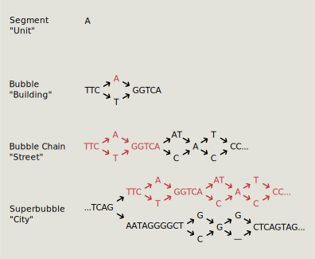

.. _implementation:
.. include:: substitutions.rst

Implementation
==================================

Back-end: BubbleGun
------------------------------

`BubbleGun 🔗 <https://github.com/fawaz-dabbaghieh/bubble_gun>`_ is a tool that identifies topological structures in a GFA file.

``Superbubble`` - a acyclic, directed subgraph where nodes *s* and *t* are the source and sink nodes, respectively.
All paths that start at *s* end up at *t*.

``Bubble`` - a specific type of superbubble where *s* only has two outgoing edges and *t* has two incoming edges. 
Ex. a simple bialleleic SNP or indel.

``BubbleChain`` - a subgraph containing one or more bubbles such that the sink node of one bubble is the soruce node of the next.

A BubbleChain contains Bubbles. A BubbleChain can also be a part of a larger SuperBubble, which in turn can be inside an even larger SuperBubble or BubbleChain.
This nested structure is computed by BubbleGun.

Back-end: Neo4j
------------------------------

`Neo4j 🔗 <neo4jurl>`_ is a graph database where data is stored as a series of Nodes and Relationships.
Neo4j mirrors the stucture of the graph genomes which makes it ideal for storage and queries.

During setup of |tool|, an rGFA file is parsed and the S,L,P,W lines are extracted.
The S (segment) lines are added to the Neo4j database as nodes with properties that include 
-length
-chrom
-start
-end
-x,y coordinates

The L (link) lines are added as ``LINKS_TO`` relationships between two Segment nodes.

.. figure:: _images/neo4j_placeholder.png
   :alt: Neo4j database schema
   :width: 500px
   :align: center

Front-end: D3 Force Graph
------------------------------

|tool| uses the `D3 Force Graph library 🔗 <https://github.com/vasturiano/force-graph>`_ to draw the graph representation.

This library is able to render the graph given a set of nodes and links.
In |tool|, segments of sequence are represented by nodes. 
These segments can have variable length and it was important to capture the length information in the rendering of the graph.
|tool| splits up longer segments into a series of connected D3 nodes, using thickly drawn links to give the illusion of length. 

.. figure:: _images/graph_explain.svg
   :alt: How the graph is drawn
   :width: 500px
   :align: center

   How the stylized segments appear (top) versus how they structured from the perspective of the D3 engine (bottom).

For example, Segments 426 and 427 above represent a SNP, and are drawn with a single D3 node.
In contrast, Segment 428 is 932 base pairs long and is drawn with 9 nodes, internally named 428#0 through 428#8.

#todo forces