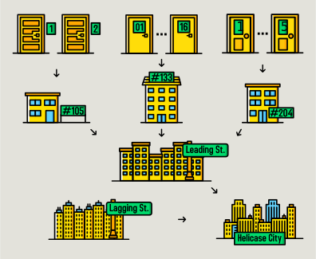

.. include:: substitutions.rst

|tool|
==================================

|tool| is a visualization tool developed for human pangenomic research. Its primary function is to offer visual representations of large graph genomes,  facilitating the exploration and analysis of complex genomic data.
 

Motivation
---------------

A visual interface is fundamental for detecting patterns and gaining meaningful insights into large, complex genomic datasets.
Pangenomes typically rely on a graph-based data structure, which is very difficult to navigate without a visualization of the graph topology.

Graph genomes are particularly challenging to analyze because they include billions of base pairs and encompass all the potential variations within them.
The range of variation size is also large. For instance, examining the relationship between a SNP and a 20kb structural variant represents a 20,000-fold difference in scale.

To overcome these issues, consider the system used for 

   Physical locations have a hierarchical relationship. The level of detail needed depends on the goal.
 

.. figure:: _images/graph_analogy2.svg
   :alt: Base Pair ➜ SNP ➜ Locus ➜ Structural Variant ➜ ...
   :align: center

   Genetic variation has a hierarchical relationship. The level of detail needed also depends on the goal.

|git|

.. toctree::
   :maxdepth: 2
   :caption: Table of Contents

   usage
   implementation
   setup
