.. _usage:
.. include:: substitutions.rst

Usage
==================================

Choosing a Region
-----------------------

|tool| provides various options for choosing the range to be visualized. 

.. figure:: _images/go_button.png
   :alt: go button
   :align: center

   **Go** section of |tool|.

.. raw:: html

   
Each method fills the above box with a set of coordinates, and clicking the <code>Go <i class="fas fa-bolt"></i></code> button initiates the visualization process.
   Below are the different methods to select a coordinate range.

Selecting by Coordinates
~~~~~~~~~~~~~~~~~~~~~~~~

The simplest way to select a range - directly by reference coordinate.

.. figure:: _images/coordinate_selector.png
   :alt: coordinate selector
   :align: center

   **Select by Reference Coordinate** section of |tool|.

Selecting by Chromosome
~~~~~~~~~~~~~~~~~~~~~~~~

Range selection can be done by choosing a chromosome and highlighting a region.

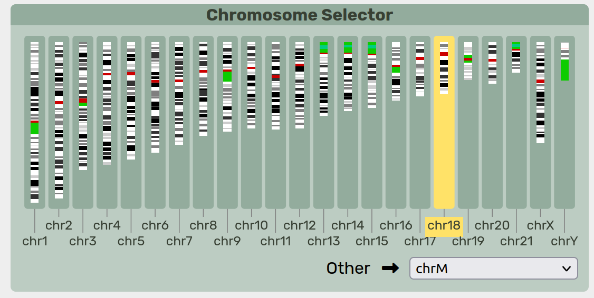

   **Chromosome Selector** section of |tool|.

By default, |tool| assumes a standard set of human chromosomes. Any non-canonical chromosome can be found in the ``Other`` dropdown box.
Only one chromosome can be highlighted at a time.

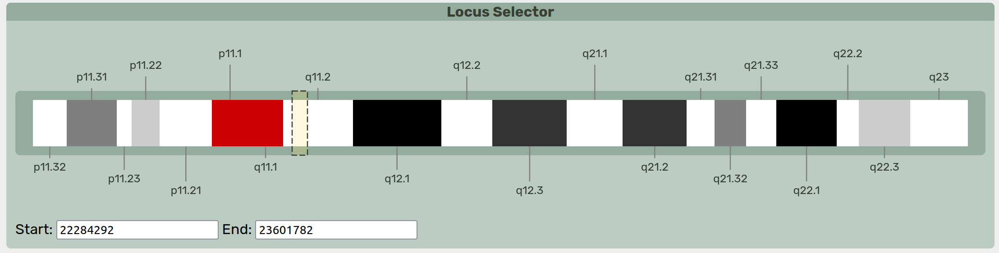

   **Locus Selector** section of |tool|.

A cytoband display of the highlighted chromosome is rendered. Clicking and dragging along the chromosome will select a specific region.
The coordinates of this region populates the **Go** section.

Selecting by Gene
~~~~~~~~~~~~~~~~~~~~~~~~

A gene search bar is included as a method to query for a particular region. Gene names and Ensembl IDs are indexed for search.
The gene annotations are sourced from `GENCODE 🔗 <https://www.gencodegenes.org/human/>`_ but if using a custom pangnome, any GFF3 file can be indexed for search.

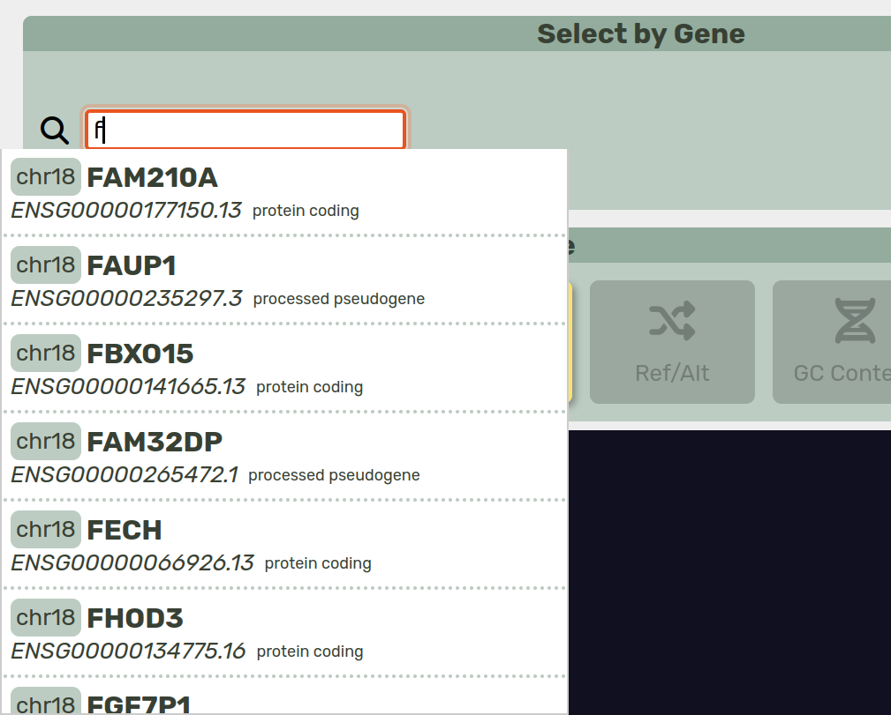

   **Select by Gene** section of |tool|.

Viewing the Pangenome
-----------------------

Rendering
~~~~~~~~~~~~~~~~~

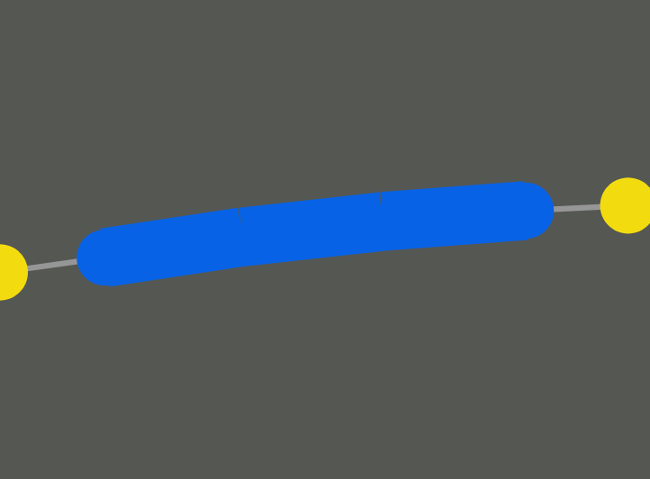

   A |segment|.

A |segment| from the rGFA file (``S`` line). 
A single chunk of sequence, has reference coordinates if on the reference path.
Links show possible paths through the pangenome (the ``L`` lines from the rGFA file).

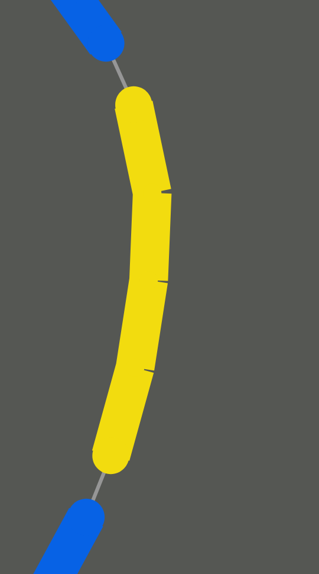

   Left shows a |bubble|, right shows the contents inside.

Hides an acyclic subgraph of branching paths that start at one |segment| and all end at another.
Can be |simple| if there are only two disjoint paths between the source and sink nodes, otherwise it is classified as |super|.

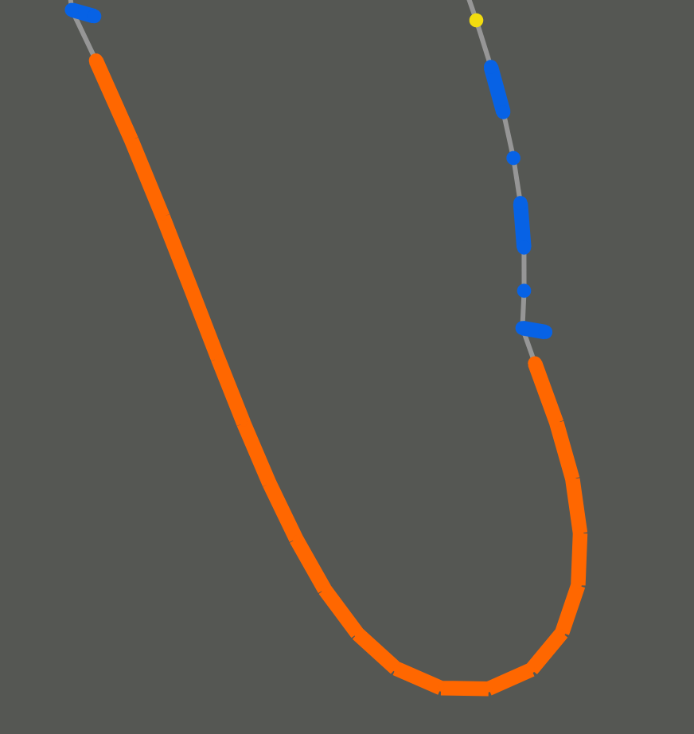

   Left shows the |chain|, right shows the contents inside.

A |chain| is a series of connected |bubble|.

Actions
~~~~~~~~~~~~~~~~~

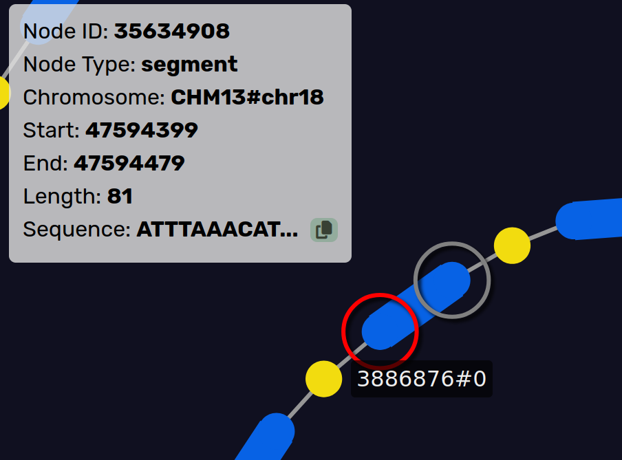

   Hovering over a node highlights it and shows information.

   Clicking and dragging a node moves it around.

   Clicking on a |bubble| or |chain| node pops it open.

Annotations
~~~~~~~~~~~~~~~~~

The gene annotations are sourced from `GENCODE 🔗 <https://www.gencodegenes.org/human/>`_ but if using a custom pangnome, any GFF3 file can be used to annotate genes.

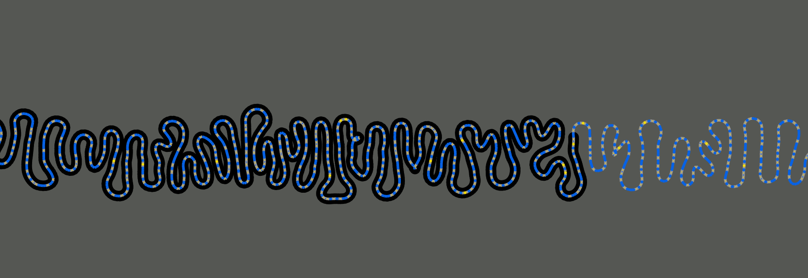

   A gene annotation.

Colors
-----------------------

Color Selection
~~~~~~~~~~~~~~~~~

|tool| provides different methods of coloring the nodes in the visualization.
Node colors are selected on a 3-color gradient.

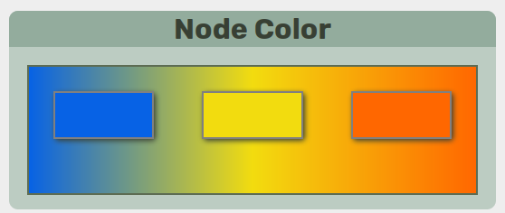

   **Node Color** section of |tool|. 

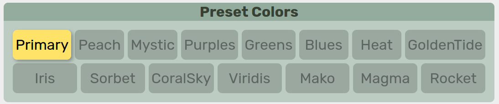

   **Preset Color** section of |tool|.

|tool| has a set of built-in color palettes that can be selected from. 
Color palette can be manually changed by clicking on each color box.

.. note:: 
    Some palettes are better for discrete colors and some are better for heatmap gradients.

.. note:: 
    An attempt was made to provide multiple colorblind-friendly palettes but not all of them are guaranteed to be safe.

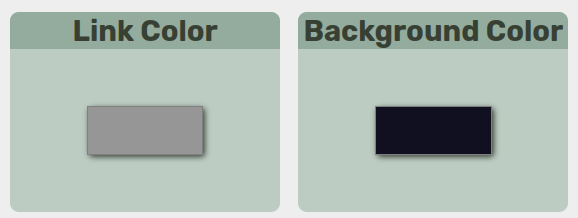

   **Link Color** and **Background Color** section of |tool|.

Additionally, link and background colors can be manually changed.

Color Style
~~~~~~~~~~~~~~~~~

Depending on the mode selected, the colors will either be used to form as a continuous gradient/heatmap or will be used as three discrete colors. 

.. raw:: html

   
<i class="fa-solid fa-circle-nodes xl"></i> <b>Node Type</b> <code>discrete</code>

The color is determined by the type of node, |segment|, |bubble| or |chain|

.. raw:: html

   
<i class="fa-solid fa-arrows-to-circle xl"></i> <b>Bubble Size</b> <code>continuous</code>

The color is determined by the total number of |segment| inside a |bubble| or |chain|. 
Not to be confused with "length" which is based on the total number of basepairs.

.. raw:: html

   
<i class="fa-solid fa-arrow-down-short-wide xl"></i> <b>Node Length</b> <code>continuous</code>

The color is determined by the total number of basepairs represented by a node. 

.. raw:: html

   
<i class="fa-solid fa-shuffle xl"></i> <b>Ref/Alt</b> <code>discrete</code>

Reference path and alternative paths are colored differently. This is a 2-color scheme that uses the two ends of the color gradient. 

.. raw:: html

   
<i class="fa-solid fa-dna xl"></i> <b>GC Content</b> <code>continuous</code>

The color is determined by the total GC percentage of all basepairs represented by a node (with the full human genome averaging 41%).

